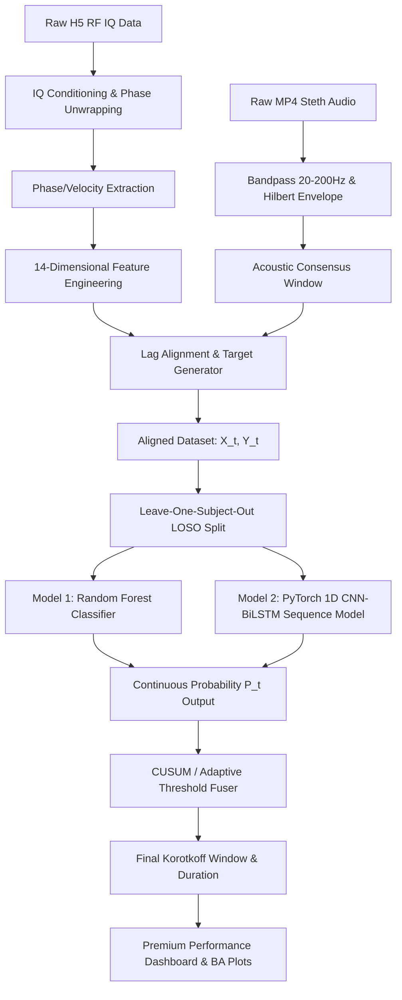

# Advanced Machine Learning Approach for Korotkoff Duration Detection

This implementation plan outlines a robust, scientifically rigorous Machine Learning (ML) and Deep Learning (DL) pipeline to detect Korotkoff sound duration from RF radar data. It transitions the project from heuristic thresholding (v3.0 baseline, Lag-Corrected IoU of 0.410) to a data-driven sequence labeling and segmentation model, using stethoscope audio as the ground truth.

---

## Technical Context & Challenges

1. **Physical Lag**: Stethoscope acoustic turbulences lag RF mechanical arterial wall motion. We must compute the session-specific cross-correlation lag and shift the ground truth labels to train a lag-aligned classifier.
2. **Subject Generalization**: With 20 sessions from 2 subjects (`Sub_1_Prof_kan` and `Sub_2_Rajveer`), random splitting leads to subject leakage and overoptimistic results. We must validate using **Leave-One-Subject-Out (LOSO) Cross-Validation** to guarantee true clinical generalization.
3. **Hardware Constraints**: The local environment has PyTorch installed but no CUDA-enabled GPU (`CUDA available: False`). The ML models must be highly optimized to train quickly on a standard CPU.

---

## Proposed Pipeline Architecture



---

## Proposed Changes

We will create a self-contained, modular ML package in `D:\Bioview\My_RF_work_v1` without modifying the working v3.0 heuristic scripts, ensuring a clean A/B comparison.

### 1. Data Processing & Feature Engineering (`koro_ml_features.py`)

#### [NEW] [koro_ml_features.py](file:///D:/Bioview/My_RF_work_v1/koro_ml_features.py)
This script will parse all 20 paired sessions, extract features, align the stethoscope ground truth using lag-correction, and export a clean dataframe for training.

* **Target Label Generation ($y_t \in \{0, 1\}$)**:
  * Extract acoustic Korotkoff envelope from stethoscope audio (20-200 Hz band).
  * Determine the physical lag $\tau$ between RF and stethoscope envelopes via cross-correlation.
  * Define ground truth: $y(t) = 1$ if $t \in [steth\_onset + \tau, steth\_offset + \tau]$ else $0$.
* **14-Dimensional Feature Vector ($X_t$)**:
  Calculated over a 1.0-second sliding window with a step size of 0.1s (10 Hz feature rate):
  1. **Vel_RMS**: RMS energy of 10-49Hz velocity (core intensity).
  2. **Vel_TKEO**: Mean Teager-Kaiser Energy (captures transient energy shifts).
  3. **Vel_Kurtosis**: Excess kurtosis (identifies sharp physiological beats vs noise).
  4. **Vel_Hilbert**: Hilbert envelope amplitude.
  5. **Vel_BandPower**: Ratio of 10-49Hz power to adjacent bands.
  6. **Vel_STFT**: Spectral energy from short-time Fourier transform.
  7. **Hjorth_Activity**: Variance of the velocity signal.
  8. **Hjorth_Mobility**: Mean frequency estimate of the velocity signal.
  9. **Hjorth_Complexity**: Bandwidth estimate of the velocity signal.
  10. **Phase_Fluctuation_RMS**: Low-frequency detrended phase fluctuation (arterial wall motion).
  11. **Disp_HR_RMS**: RMS of displacement in the Heart Rate band (0.5-3Hz).
  12. **Spectral_Entropy**: Measure of spectral complexity (Korotkoff sounds are structured; noise is high entropy).
  13. **Spectral_Centroid**: Center of mass of the frequency spectrum.
  14. **Zero_Crossing_Rate**: ZCR of velocity (differentiates high-frequency noise from physiological signals).

---

### 2. Comparative Machine Learning Framework (`koro_ml_pipeline.py`)

#### [NEW] [koro_ml_pipeline.py](file:///D:/Bioview/My_RF_work_v1/koro_ml_pipeline.py)
This module implements the training, cross-validation, and comparative analysis using two models:

#### Model A: Random Forest Classifier (Classical ML)
* **Rationale**: Stable, non-linear, robust to overfitting on small medical datasets, and outputs highly interpretable feature importances.
* **Architecture**: `RandomForestClassifier(n_estimators=150, max_depth=8, class_weight='balanced')` from `scikit-learn`.

#### Model B: PyTorch CNN-BiLSTM Temporal Model (Deep Learning)
* **Rationale**: Combines 1D CNNs to capture local morphological features with a Bidirectional LSTM to capture the global temporal context of cuff deflation.
* **Architecture**:
  * **Input Layer**: Sequence of 14-dimensional feature vectors.
  * **1D Convolutional Blocks**: Kernel size = 3, stride = 1, ReLU activation, Dropout (0.3) to extract temporal patterns.
  * **Bidirectional LSTM Layer**: Hidden size = 64, 2 layers, capturing bidirectional context (inflation history + deflation tail).
  * **Dense Output Layer**: Sigmoid activation predicting probability $P(t)$ of Korotkoff active phase.
  * **Loss Function**: Weighted Binary Cross-Entropy Loss to handle class imbalance (deflation is usually active for ~30-40% of the recording).
  * **Optimizer**: Adam (learning rate = 0.001) with Cosine Annealing scheduler.

```
PyTorch Sequence Model:
[14 Features] ──> [1D Conv (n=32)] ──> [Bi-LSTM (h=64)] ──> [Dense + Sigmoid] ──> [P(t) ∈ [0,1]]
```

---

### 3. Post-Processing & Consensus Window Fusion

The models output a smooth probability curve $P(t) \in [0, 1]$. To extract the final onset and offset:
1. Apply Page's **CUSUM Change-Point Detector** on $P(t)$ to find where the model becomes highly confident of Korotkoff onset and where the probability drops back to silence.
2. Verify constraints: `Duration = Offset - Onset` must satisfy $3.0\text{s} \le \text{Duration} \le 25.0\text{s}$.
3. Graded Confidence: Compute an integrated confidence score using the probability integral under the detected window.

---

### 4. Rigorous Leave-One-Subject-Out (LOSO) Validation Protocol

We will split the 20 sessions by subject:
* **Fold 1**: Train on `Sub_1_Prof_kan` (10 sessions) $\to$ Evaluate on `Sub_2_Rajveer` (10 sessions).
* **Fold 2**: Train on `Sub_2_Rajveer` (10 sessions) $\to$ Evaluate on `Sub_1_Prof_kan` (10 sessions).
* **Metrics Reported**:
  * **Lag-Corrected Intersection-over-Union (IoU)** (Primary metric, benchmark: v3.0 heuristic = 0.410)
  * **Raw IoU** (Secondary metric)
  * **Onset Error** (Mean absolute difference in seconds vs. Stethoscope onset)
  * **Offset Error** (Mean absolute difference in seconds vs. Stethoscope offset)
  * **F1-Score / Area Under ROC (AUROC)** for point-by-point segmentation.

---

## Premium Visualizations & Reports

We will generate publication-quality visual summaries saved to `D:\Bioview\My_RF_work_v1\data_new\Results_latest\`:
1. **Per-Session ML Dashboard (`koro_ml_dashboard_[SessionName].png`)**:
   * Panel 1: Phase velocity & stethoscope audio with ground truth vs. ML-detected windows.
   * Panel 2: Sliding feature heatmap (visualizing the 14 features over time).
   * Panel 3: Probability curves $P(t)$ from Random Forest vs. PyTorch CNN-BiLSTM.
   * Panel 4: ROC & Precision-Recall curves.
2. **Batch ML Summary Report (`koro_ml_batch_summary.png` & `koro_ml_report.txt`)**:
   * Feature Importance Chart (ranking the 14 engineered features).
   * Bland-Altman plots comparing ML vs. Stethoscope for Onset and Offset times.
   * Comparative Bar Chart: Heuristic Baseline vs. Classical ML (Random Forest) vs. Deep Learning (PyTorch CNN-BiLSTM).

---

## Verification Plan

### Automated Tests
1. **Feature Extraction Validation**: Run `koro_ml_features.py` and verify it exports a dataframe of shape $[N \times 16]$ (14 features + 1 target + 1 session ID) with zero NaNs or infs.
2. **Model Training & Convergence**: Train the PyTorch model and verify the training loss decreases monotonically over 50 epochs on CPU.
3. **LOSO Comparison**: Verify that the mean Lag-Corrected IoU of the Random Forest and PyTorch models exceed the heuristic baseline (0.410) on both folds.
4. **Window Integrity**: Ensure all detected windows satisfy physiological boundaries (duration $\ge$ 3.0s, onset $\ge$ 5.0s).

### Manual Verification
- Visual inspection of the 20 per-session dashboards and the aggregate summary plots.
- Verify Bland-Altman limits of agreement are tighter than the heuristic (e.g., limits of agreement within $\pm 2.0$ seconds).
