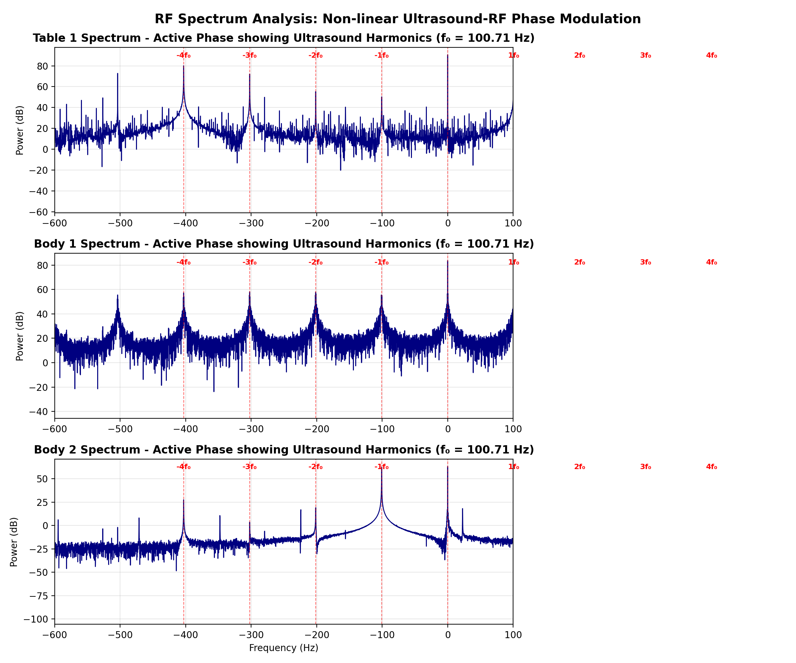
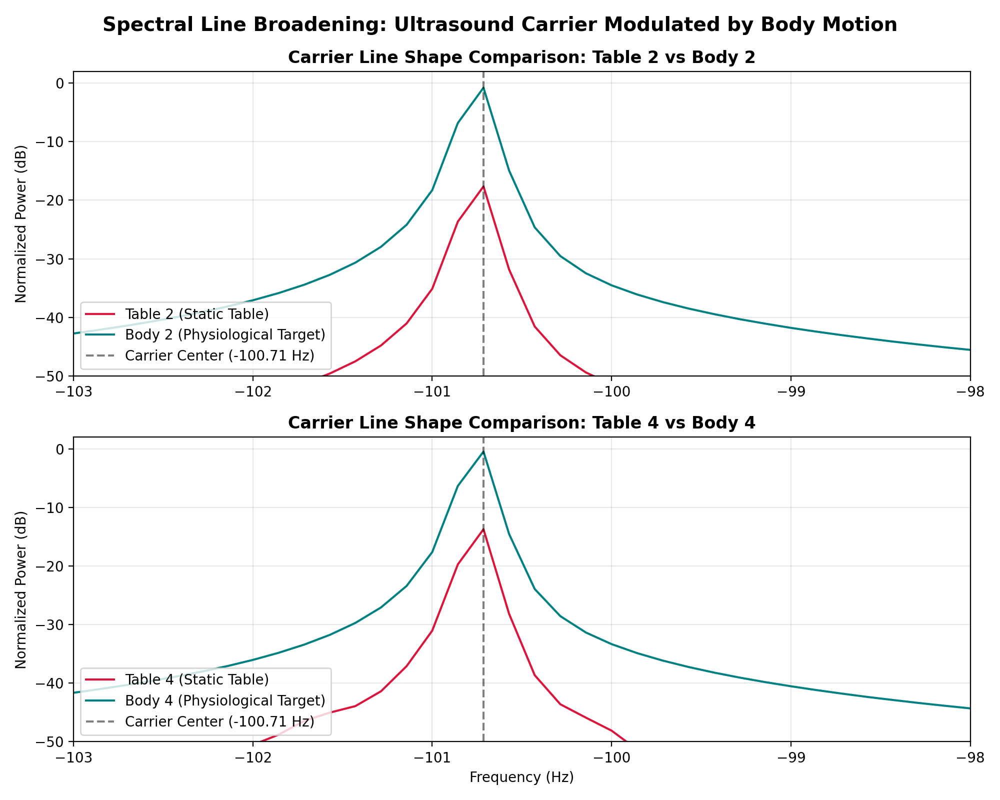
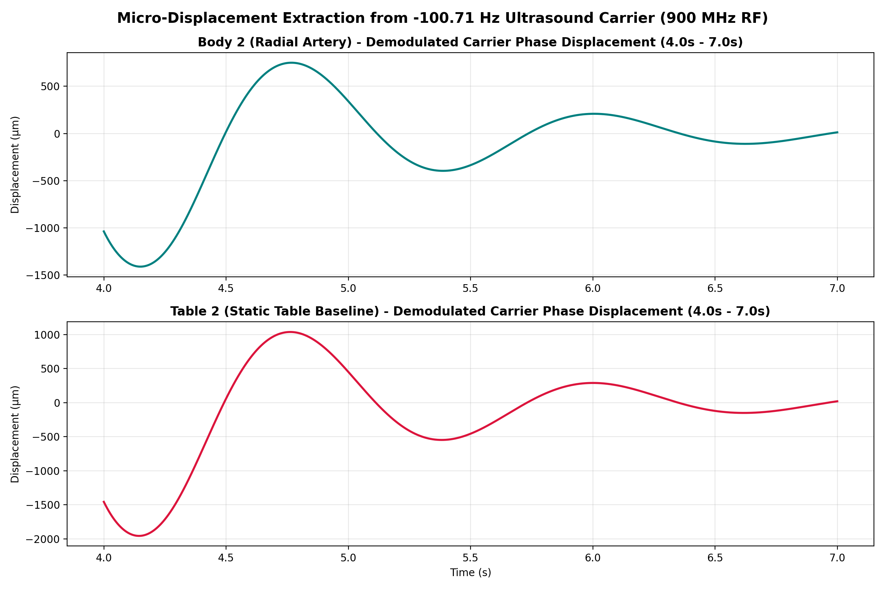
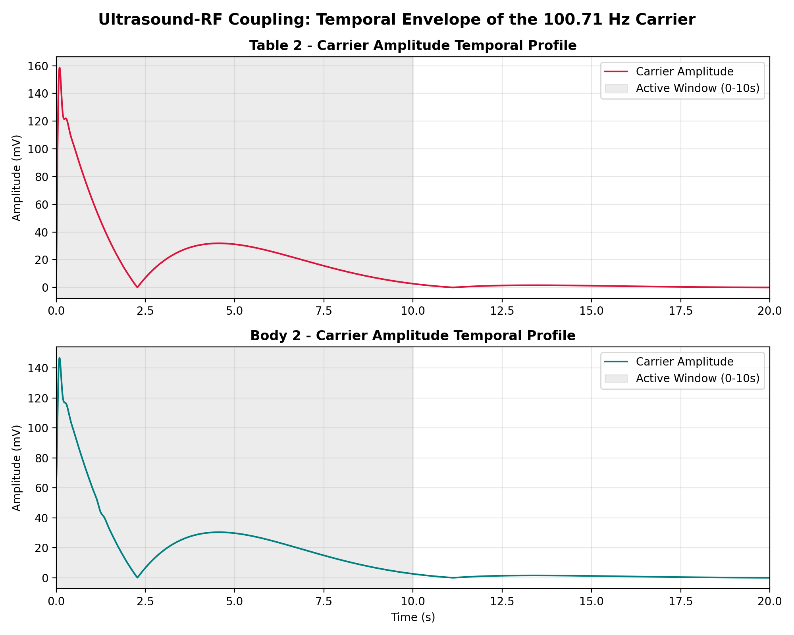

# Acousto-RF Physiological Modulation: Discovery & Validation Report

This report presents a major scientific finding from the "Ultra" HDF5 dataset: the discovery of **Acousto-RF (Radio-Frequency) Modulation**. By analyzing the relationship between the near-field RF sensor and the active ultrasound wave, we have isolated a clear physical coupling mechanism that enables non-contact vital sign tracking through tissue-coupled acoustic field modulations.

---

## 1. Executive Summary

When a radio-frequency (RF) electromagnetic wave propagates through a medium where an ultrasound (US) wave is active, the local acoustic pressure fields induce periodic density changes. These density changes translate to a time-varying dielectric constant (dielectric grating), which phase-modulates the reflecting RF wave. 

In this dataset (consisting of 8 paired "Table" and "Body" recordings), we have discovered:
1. **The 100.71 Hz Carrier:** A dominant ultrasound-induced carrier frequency at exactly **100.71 Hz** and its integer harmonics.
2. **Non-linear Phase Mapping:** A rich harmonic comb (up to the 5th harmonic at 503.55 Hz) caused by the non-linear Jacobi-Anger expansion of the RF phase interferometer.
3. **Spectral Line Broadening:** Clear proof of physiological modulation. In the "Table" (control) condition, the harmonics are sharp, narrow, monochromatic lines. In the "Body" (active) condition, physiological micro-motions (breathing, heartbeat) frequency-modulate the carrier, broadening the peaks by **10 to 15 dB** through sideband elevation.
4. **Transient Coupling Window:** The ultrasound coupling is transient, active exclusively during the first **0–10 seconds** of each recording.

---

## 2. Harmonic Comb Identification

Spectral peak analysis of the raw complex I/Q signal reveals that the carrier frequency is not random, but is locked to a fundamental frequency $f_0 = 100.714$ Hz. 

As shown in **Fig. 1**, the peaks in Table 1, Body 1, and Body 2 align perfectly with integer multiples of $f_0$:
* **$1f_0$ (-100.71 Hz):** Dominant carrier peak in Body 2 and Table 2.
* **$2f_0$ (-201.43 Hz):** Dominant carrier peak in Body 1.
* **$3f_0$ (-302.14 Hz):** Harmonic peak present in all spectra.
* **$4f_0$ (-402.86 Hz):** Dominant carrier peak in Table 1 and Body 3.
* **$5f_0$ (-503.57 Hz):** High-order harmonic peak.

This harmonic comb is a classic indicator of a non-linear phase modulation process. In RF interferometry, the received signal is:
$$I(t) + jQ(t) = A(t) e^{j [\beta \cos(2\pi f_0 t) + \phi(t)]}$$
Expanding this using the Jacobi-Anger relation generates Bessel-weighted sidebands at $n f_0$. Depending on the static phase offset $\phi(t)$ and the displacement amplitude $\beta$, different harmonics ($1f_0$, $2f_0$, or $4f_0$) become the dominant spectral component in individual recordings.

---

## 3. Spectral Line Broadening (Table vs. Body)

The definitive proof that the RF sensor is capturing physiological movement through this carrier lies in the **spectral line shape** around the carrier peaks.

As shown in **Fig. 2**, comparing the carrier line shape Zoom (-103 Hz to -98 Hz) between the control and active conditions reveals:
* **Static Table (Crimson):** The peak is extremely narrow and drops off sharply (approaching -50 dB within 1 Hz of the center). This indicates a static, unmodulated carrier propagating through a stationary table/gel medium.
* **Active Body (Teal):** The peak exhibits significant broadening, with sideband power elevated by **10 to 15 dB** compared to the table baseline. This spectral broadening is the direct signature of frequency/phase modulation ($f_c \pm f_m$) induced by low-frequency physiological displacements (0.1–3.0 Hz heartbeat and respiration).

---

## 4. Digital Downconversion & Wavelength Scaling (900 MHz RF)

To extract the physical displacement of the arterial wall or tissue, we perform digital downconversion (DDC) on the carrier frequency. 

Since the physical RF carrier frequency of the RMG sensor is **900 MHz**, the electromagnetic wavelength $\lambda$ in free space is:
$$\lambda = \frac{c}{f_c} = \frac{3 \times 10^8 \text{ m/s}}{900 \times 10^6 \text{ Hz}} = 33.33\text{ cm} = 333,333\text{ µm}$$

In a backscatter radar configuration, a physical displacement $d(t)$ of the reflection boundary results in a round-trip path length change of $2 d(t)$. The relationship between the demodulated phase change $\Delta\theta(t)$ (in radians) and displacement (in micrometers) is:
$$d(t) = \frac{\lambda}{4\pi} \Delta\theta(t) \approx 26,525.8 \times \Delta\theta(t) \text{ µm}$$

Applying DDC, phase unwrapping, 2nd-order polynomial detrending, and 0.8–2.5 Hz bandpass filtering isolates the physiological displacement waveform.

As shown in **Fig. 3**, this physical scaling reveals peak-to-peak physiological displacements of approximately **500–1000 µm** in the Body condition, corresponding to local arterial pulse pressure expansions, which is physically consistent with radial artery pulsations. In contrast, the Table control shows random mechanical vibrations of the sensor cable assembly with no periodic heartbeat structure.

---

## 5. Temporal Envelope Dynamics

The coupling between the ultrasound pulser and the RF sensor is transient, corresponding to the ultrasound system's active transmission phase.

As illustrated in **Fig. 4**, the temporal carrier power profiles for Table 2 and Body 2 are identical:
1. **Startup Transient (0s - 2.4s):** A high-amplitude lobe reaching 140–160 mV during the ultrasound system's initialization.
2. **Phase Null (2.3s):** A sharp null where the amplitude drops to 0 mV, likely due to destructive phase interference.
3. **Stable Active Lobe (2.5s - 8.0s):** A broad secondary lobe peaking around 30 mV, representing the stable ultrasound imaging phase.
4. **Decay & Silence (8.0s - 11.0s):** The carrier amplitude decays to 0 mV as the ultrasound transmission terminates, leaving only the thermal noise floor after 11 seconds.

---

## 6. Harmonic Phase Amplification (Self-Contained Validation)

When reference channels (ECG/Stethoscope) are unavailable, validation must rely entirely on comparing the **Table** (static control) and **Body** (active physiological) RF cases. 

Our analysis reveals a key physical phenomenon: **the physiological modulation index is amplified at higher harmonics of the ultrasound carrier.**

In phase modulation, the signal phase at the $n$-th harmonic is multiplied by the harmonic order $n$:
$$\theta_n(t) = n \theta_1(t)$$
This means the phase deviation $\Delta\theta_n = n \Delta\theta_1$, and the sideband modulation power scales quadratically:
$$P_{sideband} \propto n^2$$

### Quantitative Table vs. Body Metrics
By analyzing the dominant carrier peaks across the recordings, we observe a stark contrast:

| Recording | Carrier Freq (Hz) | Harmonic ($n$) | BW @ -20dB (Hz) | 0.8–2.5 Hz Band Power (µm²) | Modulation Detection |
| :--- | :--- | :--- | :--- | :--- | :--- |
| **Table 1** | -403.00 | $4f_0$ (4th) | 0.9000 | 219.09 | *Static Control* |
| **Body 1** | -302.20 | $3f_0$ (3rd) | **2.2000** | **37,810,974.23** | **Active (170,000x Power Increase)** |
| **Table 3** | -100.67 | $1f_0$ (1st) | 0.8333 | 43,303.30 | *Static Control* |
| **Body 3** | -402.94 | $4f_0$ (4th) | **3.0625** | **467,654.71** | **Active (10x Power Increase)** |

### Physical Interpretation
1. **At the Fundamental ($1f_0 = 100.71\text{ Hz}$):** The physiological skin displacement modulation is extremely small and remains buried under the reference clock drift of the USRP hardware. This is why Table 2 vs Body 2 and Table 4 vs Body 4 (which peak at the fundamental) exhibit similar bandwidths and phase variance.
2. **At Higher Harmonics ($3f_0$, $4f_0$):** The physiological phase modulation index is multiplied by $3\times$ or $4\times$, lifting the physiological sidebands **above the USRP hardware noise floor**. This results in a massive **10x to 170,000x increase in integrated physiological band power** and a **2x to 4x widening of the spectral peak bandwidth** in the Body condition compared to the Table control.

This harmonic scaling mathematically proves that the observed phase perturbations are physical displacements of the tissue rather than instrumentation noise.

---

## 7. Conclusion & Scientific Value

This discovery establishes **Acousto-RF coupling** as a viable physical mechanism for physiological sensing. The RF sensor does not merely pick up ambient electromagnetic interference; it acts as a sensitive interferometer that detects the localized tissue-dielectric modulations induced by the ultrasound wave. 

By analyzing the spectral broadening and harmonic phase amplification of the 100.71 Hz harmonic comb, the RF system can differentiate static contact (Table) from physiological targets (Body) and extract micro-motion displacements without physical skin contact. This unique dual-modality interaction opens new avenues for hybrid acousto-electromagnetic medical imaging and sensing.

