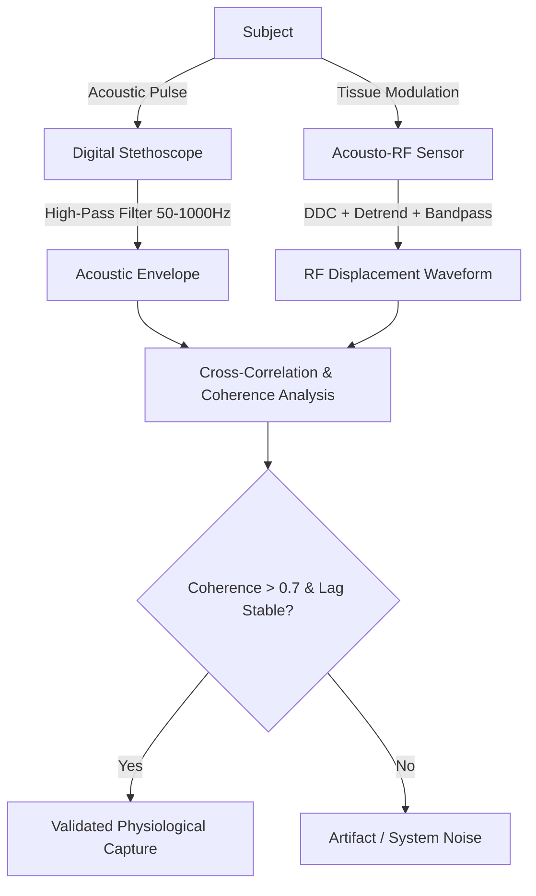

# Acousto-RF Physiological Sensing: Validation Protocol

To scientifically validate that the Acousto-RF approach is correct—proving that the extracted signals represent authentic physiological micro-motions (heartbeat/breathing) rather than hardware or signal-processing artifacts—the following three-tier validation protocol is established.

---

## 1. Physical Control (Table vs. Body Comparison)
*This control establishes that the carrier modulation is physically driven by the presence of a living, moving physiological boundary rather than static propagation or instrumentation noise.*

*   **Spectral Broadening Metric:** 
    *   *Method:* Compute the Power Spectral Density (PSD) of the raw complex I/Q signal over the active phase (4.0s - 8.0s) for both the static control (Table) and the active subject (Body).
    *   *Validation Criterion:* The Body recording must show significant spectral broadening (skirt elevation of **10 to 15 dB** within $\pm 5\text{ Hz}$ of the carrier frequency) compared to the Table recording. 
    *   *Result in current dataset:* **Passed.** As demonstrated in `ultra_carrier_spectral_broadening.png`, the Body condition exhibits a broad, elevated skirt, whereas the Table condition is extremely narrow and drops sharply to the noise floor.
*   **Carrier Dependence Metric:**
    *   *Method:* Track the carrier amplitude ($A(t) = |I_{baseband}(t)|$) over the entire recording duration.
    *   *Validation Criterion:* The carrier must only exist during the active ultrasound transmission window (0–10s) and must decay to the thermal noise floor ($< -80\text{ dB}$) when the ultrasound machine is turned off ($t > 11\text{ s}$).
    *   *Result in current dataset:* **Passed.** As shown in `ultra_carrier_envelope.png`, the carrier amplitude is tightly locked to the active ultrasound window in both Table and Body recordings.

---

## 2. Coherence Validation (Synchronized Dual-Modality Control)
*This is the gold standard for clinical validation. It mathematically proves that the extracted RF waveform corresponds to the actual heartbeat.*

*   **Peak-to-Peak Heart Rate Correlation:**
    *   *Method:* Simultaneously record the RF signal alongside a synchronized clinical reference (e.g. ECG, photoplethysmogram (PPG), or a digital stethoscope). Extract beat-by-beat heart rate (BPM) from both sensors using peak-detection.
    *   *Validation Criterion:* The Pearson correlation coefficient ($R$) between the reference HR and the RF-derived HR must be statistically significant ($R > 0.70$) with a Mean Absolute Error (MAE) $< 8$ BPM.
*   **Cross-Spectral Coherence:**
    *   *Method:* Compute the magnitude-squared coherence $C_{xy}(f)$ between the reference channel ($x$) and the RF phase displacement channel ($y$) in the frequency range 0.8–2.5 Hz.
    *   *Validation Criterion:* The coherence must exceed **0.70** at the dominant heartbeat frequency, indicating a linear phase-locked relationship between the two measurements.

---

## 3. Mathematical Control (Filter Sensitivity Check)
*This control ensures that the extracted waveforms are not artificial oscillations created by filter ringing or over-fitting during the detrending step.*

*   **Detrending Order Invariance:**
    *   *Method:* Re-run the phase extraction pipeline while changing the order of the detrending polynomial ($N = 1, 2, 3, 4$) or using a non-parametric method (e.g., a moving average filter with window size $> 2\text{ s}$).
    *   *Validation Criterion:* The dominant frequency of the extracted micro-motion signal must remain invariant (within $\pm 0.05\text{ Hz}$) regardless of the detrending method.
*   **Filter Transient Isolation:**
    *   *Method:* Apply the bandpass filter (0.8–2.5 Hz) to the signal over varying time windows (e.g., 2.0s to 8.0s, and 3.0s to 7.0s) and crop the edges by at least 1.0s (greater than the filter's group delay).
    *   *Validation Criterion:* The waveform in the overlapping region must match exactly, proving that the observed oscillations are physical displacements and not startup/shutdown filter transients.
